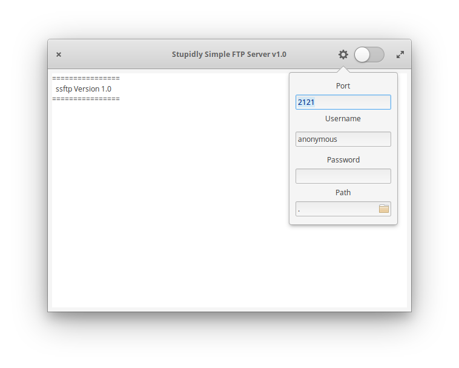

# Stupidly Simple FTP Server

### What is it?

This python script is based on Giampaolo Rodola's pyftplib Library and aims to
bring this program to anybody whithout the need for a command line nor python knowledge.
It is written on top of the GTK3 Toolkit running consequently on any major distro.

### Pre-Requisites:

*These pre-requisites are just to be installed if you choose the manual installation, if on the other hand, you install the packet via apt, then the dependencies are taken care of automatically.*
· Python3. OK, that was an ovious one...
· pyftpdlib. On any ubuntu-ish distro, you may install the library with the following command line:

```
sudo apt install python3-pyftpdlib
```

### Install

You may install the package via an unsigned DEB package available in the releases section, or you may install the file manually. The script shall be stored under `usr/local/bin/` so it can be executed from everywhere, but if you have another preference, that's fine. The script doesn't *HAVE* to be stored under this directory, it will work just fine elsewhere. If you choose to install the script manually, the please be aware that you might need to generate a `*.desktop` file manually.

### How does it work?

When you open the program, you are presented with this screen:


If you just click the switch, the server will start with it's default values:


These values are:

* Port: 2121
* User: anonymous
* Pass: none ( this is an empty string, not the word none )
* Dir : . ( that is the local directory the program is run from )

The anonymous user has no write permissions though. This may be fine with you, but if you want to be able to explore your filesystem, upload and change files, you have to add a user. To accomplish this, just push the config button prior to starting the server:



Go ahead and change the values to suit you needs. The values are stored, as soon as the dialog is closed, so no apply or save procedure is neccessary. Now go ahead and flick the switch and enjoy the server...

### Known Issues
Setting the loglevel to anything higher than INFO as well as getting an ERROR,
causes the program to crash with a segfault. I will have to look into that more closely.

### Based on
`pyftpdlib` library by Giampaolo Rodola available on [GitHub](https://github.com/giampaolo/pyftpdlib)

`pyGObject` library by the GNOME Project available on [Github](https://github.com/GNOME/pygobject)
